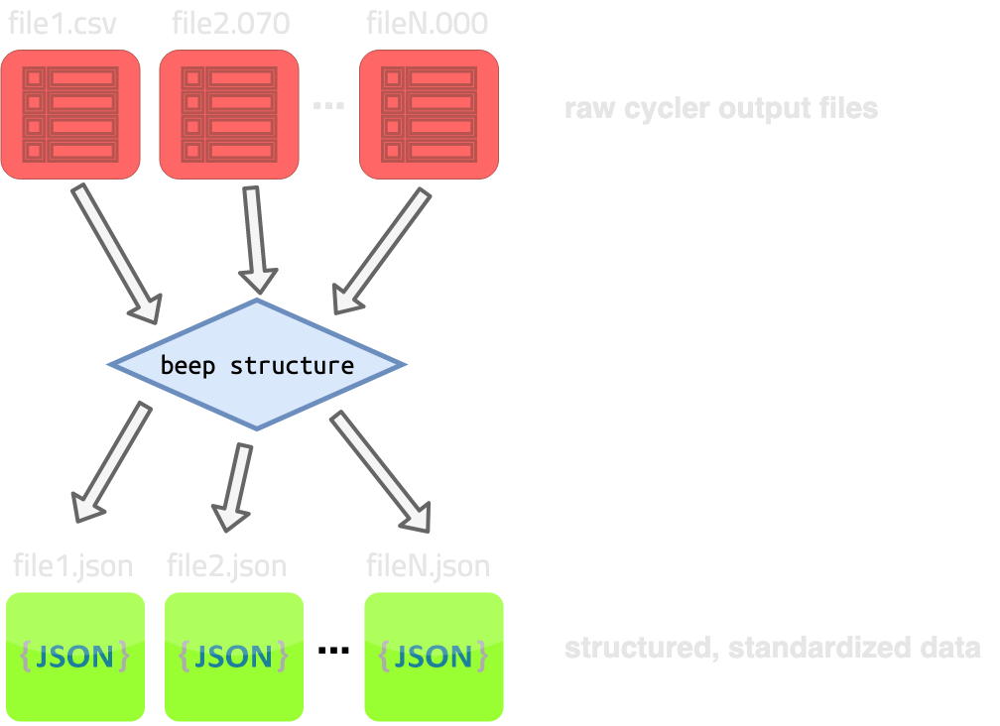

# Structure


The `beep structure` command takes in *N* raw battery cycler files (mostly text or csv) and produces *N* standardized, structured data json files. 



The structured json files can be loaded either with the BEEP python `BEEPDatapath` interface (see [Advanced Structuring](/Python%20tutorials/2%20-%20structuring/)) or with subsequent CLI commands such as `beep featurize` (see [CLI - Featurize](/Command%20Line%20Interface/3%20-%20featurize/)).


## Structuring help dialog

```
Usage: beep structure [OPTIONS] [FILES]...

  Structure and/or validate one or more files. Argument is a space-separated
  list of files or globs.

Options:
  -o, --output-filenames PATH     Filenames to write each input filename to.
                                  If not specified, auto-names each file by
                                  appending`-structured` before the file
                                  extension inside the current working dir.
  -d, --output-dir DIRECTORY      Directory to dump auto-named files to. Only
                                  works if--output-filenames is not specified.
  -p, --protocol-parameters-dir DIRECTORY
                                  Directory of a protocol parameters files to
                                  use for auto-structuring. If not specified,
                                  BEEP cannot auto-structure. Use with
                                  --automatic.
  -v, --v-range <FLOAT FLOAT>...  Lower, upper bounds for voltage range for
                                  structuring. Overridden by auto-structuring
                                  if --automatic.
  -r, --resolution INTEGER        Resolution for interpolation for
                                  structuring. Overridden by auto-structuring
                                  if --automatic.
  -n, --nominal-capacity FLOAT    Nominal capacity to use for structuring.
                                  Overridden by auto-structuring if
                                  --automatic.
  -f, --full-fast-charge FLOAT    Full fast charge threshold to use for
                                  structuring. Overridden by auto-structuring
                                  if --automatic.
  -c, --charge-axis TEXT          Axis to use for charge step interpolation.
                                  Must be found inside the loaded dataframe.
                                  Can be used with --automatic.
  -x, --discharge-axis TEXT       Axis to use for discharge step
                                  interpolation. Must be found inside the
                                  loaded dataframe. Can be used with--
                                  automatic.
  -b, --s3-bucket TEXT            Expands file paths to include those in the
                                  s3 bucket specified. File paths specify s3
                                  keys. Keys can be globbed/wildcarded. Paths
                                  matching local files will be prioritized
                                  over files with identical paths/globs in s3.
                                  Files will be downloaded to CWD.
  --automatic                     If --protocol-parameters-path is specified,
                                  will automatically determine structuring
                                  parameters. Will override all manually set
                                  structuring parameters.
  --validation-only               Skips structuring, only validates files.
  --no-raw                        Does not save raw cycler data to disk. Saves
                                  disk space, but prevents files from being
                                  partially restructued.
  --s3-use-cache                  Use s3 cache defined with environment
                                  variable BEEP_S3_CACHE instead of
                                  downloading files directly to the CWD.
  --help                          Show this message and exit.

```


## Specifying output locations

There are three options for specifying output filenames:

- **Specify all output filenames, one for each input file.** Should be `json`. Use `--output-filenames` (`-o`) to specify files, for example:

```shell
    
$: beep structure -o output1.json -o /path/to/output2.json input1.csv input2.csv
    
# Outputs output1.json in the CWD and output2.json at /path/to/output.json. 
```

- **Specify an output directory where auto-named files will be output.** Directory should exist.  Use `--output-dir` to specify.

```shell
    
$: beep structure -d /path/to/output_dir input1.csv input2.csv
    
# Outputs 
# - /path/to/output_dir/input1-structured.json
# - /path/to/output_dir/input2-structured.json
```


- **Automatically named files output in CWD.** No options needed.

```shell
    
$: beep structure input1.csv input2.csv
    
# Outputs in the CWD:
# - ./input1-structured.json
# - ./input2-structured.json
```


## Select files (including from S3)

Input files can be named individually or globbed. Input files should be supported by BEEP; see [Cycler Data Requirements](/data/) for more details. 


Example 1:

```shell
$: beep structure file1.csv file2.070
```


*Input files do not need to belong to the same cycler type to work together in one operation.*


Example 2:

```shell
$: beep structure /path/to/some_files/* /other/path/file.csv
```


If you pass the `--s3-bucket` argument, you can select files or globs based on keys in this bucket. Note you
must have boto3 set up in order to use the S3 files with BEEP. 


Example for S3:

```shell
S: beep structure --s3-bucket XXXXXXXXXXXXX /my/s3/key.071 
```


## Customize structuring parameters

You can customize the structuring parameters using these individual variables:

- `--v-range`
- `--resolution`
- `--nominal-capacity`
- `--full-fast-charge`
- `--charge-axis`
- `--discharge-axis`

Example:

```shell
$: beep structure * --v-range 0.5 0.9 --resolution 200 --nominal-capacity 1.1 --full-fast-charge 0.9
```


Alternatively, you can use automatic structuring by passing the `--automatic` flag. While this flag will by default
use a general-purpose set of files for determining structuring parameters, you can specifcy your own parameters for 
autostructuring by passing both `--automatic` and `--protocol-parameters-dir`. For example


```shell
$: beep structure * --protocol-parameters-dir /path/to/my/params --automatic
```


## Failing or invalid files

If any of your files fail or are invalid, you can inspect the full traceback in the status json if you have `--output-status-json` 
specified in the [base beep command](/Command%20Line%20Interface/1%20-%20overview/).

If this does not provide enough information, you can use the [inspect command](/Command%20Line%20Interface/7%20-%20inspect/) to examine your file, if it can be loaded.