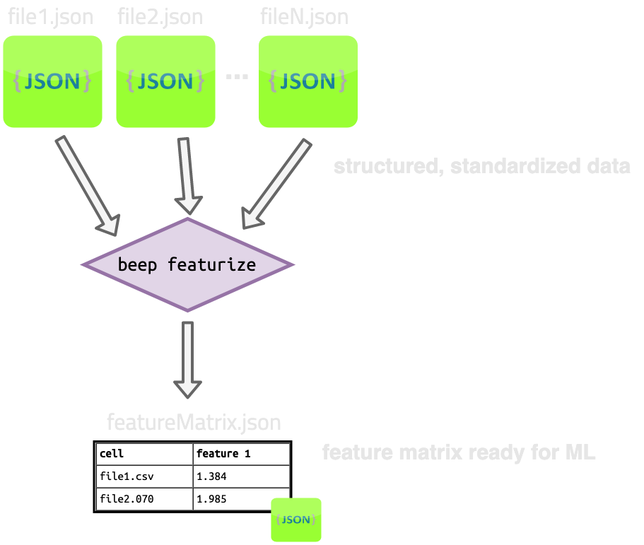

# Featurize

Featurize (`beep featurize`) is a way to robustly apply many feature generation routines (featurizers) with
different hyperparameters to large sets of files (e.g., a thousand structured cycler files).

The input to `beep featurize` is *N* structured/processed json files from `beep structure`.

The output of `beep featurize` is 1 feature matrix file (no matter how many featurizers are applied). Also, optionally *N x M* featurizer 
intermediate files for *M* featurizers (one for each featurizer applied to each file.)

Each row of the output feature matrix corresponds to a single cycler file:

```shell

target_matrix
               capacity_0.83::TrajectoryFastCharge             ...          rpt_1Cdischarge_energy0.8_real_regular_throughput::DiagnosticProperties
filename                                                       ...                                                                                                                                           
file1                         284                              ...                                                NaN                                                                                        
file2                          58                              ...                                        1266.108637                                                                                        
file3                          85                              ...                                                NaN                                                                                        
file4                         101                              ...                                                NaN                                                                                        

```


`beep featurize` is used for both generating learning features (e.g., voltage under some condition) **and** targets such as degradation metrics (e.g., cycles to reach a specific capacity).




## Featurization help dialog


```sh
$: beep featurize --help

Usage: beep featurize [OPTIONS] [FILES]...

  Featurize one or more files. Argument is a space-separated list of files or
  globs. The same features are applied to each file. Naming of output files is
  done automatically, but the output directory can be specified.

Options:
  -o, --output-filename FILE      Filename to save entre feature matrix to. If
                                  not specified, output filewill be named with
                                  FeatureMatrix-[timestamp].json.gz. If
                                  specified, overrides the output dir for
                                  saving the feature matrix to file.
  -d, --output-dir DIRECTORY      Directory to dump auto-named files to.
  -f, --featurize-with TEXT       Specify a featurizer to apply by class name,
                                  e.g. HPPCResistanceVoltageFeatures. To apply
                                  more than one featurizer, use multiple -f
                                  <FEATURIZER> commands. To apply sets ofcore
                                  BEEP featurizers, pass either 'all_features'
                                  for all features or'all_targets' for all
                                  targets (features which can be used as
                                  targets). Note if 'all_features' or
                                  'all_targets' is passed, other -f
                                  featurizers will be ignored. All feautrizers
                                  are attempted to apply with default
                                  hyperparameters; to specify your own
                                  hyperparameters, use --featurize-with-
                                  hyperparams.Classes from installed modules
                                  not in core BEEP can be specified with the
                                  class name in absolute import format, e.g.,
                                  my_package.my_module.MyClass.
  -h, --featurize-with-hyperparams TEXT
                                  Specify a featurizer to apply by class name
                                  with your own hyperparameters.(such as
                                  parameter directories or specific values for
                                  hyperparametersfor this featurizer), pass a
                                  dictionary in the format:
                                  '{"FEATURIZER_NAME": {"HYPERPARAM1":
                                  "VALUE1"...}}' including the single quotes
                                  around the outside and double quotes for
                                  internal strings.Custom hyperparameters will
                                  be merged with default hyperparameters if
                                  the hyperparameter dictionary is
                                  underspecified.
  --save-intermediates            Save the intermediate BEEPFeaturizers as
                                  json files. Filenames are autogenerated and
                                  saved in output-dir if specified; otherwise,
                                  intermediates are written to current working
                                  directory.
  --help                          Show this message and exit.

```


## Specifying input

The inputs for `beep featurize` are structured json output files from `beep structure`; Alternatively, structured data serialized with `BEEPDatapath` in python will also work.

Files can be globbed.


## Specifying outputs

The `beep featurize` command outputs a feature matrix as its required sole output. This file will
be auto-named if `--output-filename` is not specified. 

To include saving of intermediate featurizer files, use the `--save-intermediates` flag. These files will be auto-named and put into the CWD if `--output-dir` is not set.

Specifying `--output-dir` overrides `--output-filename` and will save *all* files (including intermediates) into this directory with automatic naming.


## Selecting featurizers to apply


### Featurizers in BEEP

`beep featurize` works with "core" features in BEEP. 


To use one with default hyperparameters, use the `--featurize-with` or `-f` option with the class name of the featurizer you'd like to use.

For example, to apply the `HPPCResistanceVoltageFeatures` and `CycleSummaryStats` featurizers, 


```shell
$: beep featurize -f HPPCResistanceVoltageFeatures -f CycleSummaryStats my_structured_file.json
```


You can apply the full set of featurizers for generating learning features by passing `--featurize-with all_features`:

```shell
$: beep featurize -f all_features my_structured_file.json
```

Similarly, for features from which degradation targets can be derived, pass `--featurize-with all_targets`

```shell
$: beep featurize -f all_targets my_structured_file.json
```

*Note passing `all_features` or `all_targets` will override any other `--featurize-with` classes.*


### Featurizers with custom hyperparameters

To use custom hyperparameters in `beep featurize`, pass each featurizer + hyperparameter set with `--featurize-with-hyperparams` or `-h`.


Each featurizer should be passed in dictionary format with one or more valid hyperparameters defined, like this:

```shell
{
  "HPPCResistanceVoltageFeatures":
      {
        "diag_pos": 1,
        "soc_window": 8,
      }
}
```

```shell
$: beep featurize -h '{"HPPCResistanceVoltageFeatures":{"diag_pos": 1, "soc_window": 8}}' my_structured_file.json
```

Hyperparameters not specified will be merged with the default hyperparameter dictionary defined for each featurizer.
Consult the source code for full specifications of each hyperparameter dictionary for any featurizer.

To apply multiple featurizers with custom hyperparameters (even the same featurizer class with different hyperparameters), simply use multiple **separate** `--featurize-with-hyperparams` options:

```shell
$: beep featurize -h '{"HPPCResistanceVoltageFeatures":{"diag_pos": 1, "soc_window": 8}}' \
  -h '{"HPPCResistanceVoltageFeatures":{"diag_pos": 47, "soc_window": 10}}' \
  -h '{"DiagnosticSummaryStats": {"test_time_filter_sec": 1e4}}' \
  my_structured_file.json
```


### Your own featurizers


`beep featurize` also works with external featurizers than inherit the `BEEPFeaturizer` class. 

Instead of using the class name to identify the featurizer, use `--featurize-with*` options with the **full module and class name** of your custom featurizer.

For example, if your featurizer inheriting `BEEPFeaturizer` is installed in your environment in a module `my_pkg.my_module.my_submodule.MyClass`, do:

```shell
$: beep featurize -f my_pkg.my_module.my_submodule.MyClass my_structured_file.json
```


Similar to the core featurizers, calling external featurizers with `--featurize-with` will call them with the default hyperparameters. Using custom
hyperparameters should use the same format as `--featurize-with-hyperparams`, a dictionary with the only key being the fully specified class name
and the value being a dictionary of hyperparameters to override:

```shell
$: beep featurize -h '{"my_pkg.my_module.my_submodule.MyClass": {"my_hp1": 12}}' \
  my_structured_file.json
```

Any number of external featurizers can be used alongside any number of builtin featurizers in the same command by passing multiple `--featurize-with` options:


```shell
$: beep featurize -f HPPCResistanceVoltageFeatures \
  -h '{"my_pkg.my_module.my_submodule.MyClass": {"my_hp1": 12}}' \
  my_structured_file.json
```

