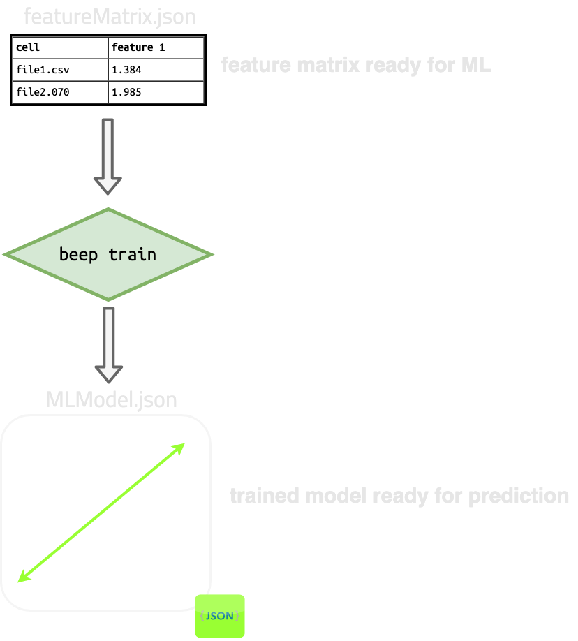

# Train

`beep train` is a one line command to perform hyperparameter tuning and model fitting on previously generated
feature matrices.

As input, `beep train` takes:

- the feature matrix file containing the features for learning
- the feature matrix file containing the targets (e.g., degradation-related metrics) to fit on


As output, `beep train` produces a single json file of the serialized model. 




## Train help dialog

```shell
$: beep train --help

Usage: beep train [OPTIONS]

  Train a machine learning model using all available data and save it to file.

Options:
  -o, --output-filename FILE      Filename (json) to write the BEEP linear
                                  model object to when training is finished.
  -fm, --feature-matrix-file FILE
                                  Featurization matrix serialized to file,
                                  containing features (X) for learning.
                                  Featurization matrices can be generated by
                                  the beep featurize command.  [required]
  -tm, --target-matrix-file FILE  Featurization matrix serialized to file,
                                  containing targets (one y or more) for
                                  learning. Featurization matrices can be
                                  generated by the beep featurize command.
                                  [required]
  -t, --targets TEXT              Target columns to as from target matrix
                                  file. Must all be present in the target
                                  matrix file. If more than 1 is specified
                                  (e.g., -t 'col1' -t 'col2'), multitask
                                  regression will be performed. Column names
                                  will be '<Feature Name>::<Featurizer Class
                                  Name>' if --homogenize-features is set. If
                                  not, column names include long parameter
                                  hashes which must be included in this
                                  argument option.  [required]
  -m, --model-name TEXT           Name of the regularized linear model to use.
                                  Current selection includes ('elasticnet',
                                  'ridge', 'lasso').  [required]
  -s, --train-on-frac-and-score FLOAT
                                  Do hyperparameter tuning on part (a training
                                  fraction) of the dataset and use that fitted
                                  model to predict on a testing fraction of
                                  the dataset. Specify the training fraction
                                  as a float 0-1.
  -al, --alpha-lower FLOAT        Lower bound on the grid for the alpha
                                  hyperparameter  which will be explored
                                  during hyperparameter tuning. Must be
                                  specified with --alpha-upper and --n-alphas.
  -au, --alpha-upper FLOAT        Upper bound on the grid for the alpha
                                  hyperparameter  which will be explored
                                  during hyperparameter tuning. Must be
                                  specified with --alpha-lower and --n-alphas.
  -an, --n-alphas FLOAT           Number of linearly spaced alphas to explore
                                  during hyperparameter tuning. If not
                                  specified, sklearn defaults are used. Must
                                  be specified with --alpha-upper and --alpha-
                                  lower.
  --train-feature-nan-thresh FLOAT
                                  Threshold to keep a feature in the training
                                  dataset, in fraction of samples which must
                                  not be nan from 0-1. 0 = any feature having
                                  any nan is dropped, 1 = no features are
                                  dropped.
  --train-sample-nan-thresh FLOAT
                                  Threshold to keep a sample from the training
                                  data, in fraction of features which must not
                                  be nan from 0-1. 0 = any sample having any
                                  nan feature is dropped, 1 = no samples are
                                  dropped.
  --predict-sample-nan-thresh FLOAT
                                  Threshold to keep a sample from any
                                  prediction set, including those used
                                  internally, in fraction of features which
                                  must notbe nan.
  --drop-nan-training-targets     Drop samples containing any nan targets. If
                                  False and the targets matrix has nan
                                  targets, the command will fail.
  --impute-strategy TEXT          Type of imputation to use, 'median', 'mean',
                                  or 'none'.
  --kfold INTEGER                 Number of folds to use in k-fold
                                  hyperparameter tuning.
  --max-iter INTEGER              Number of iterations during training to fit
                                  linear parameters.
  --tol FLOAT                     Tolerance for optimization.
  --l1-ratios TEXT                Comma separated l1 ratios to try in
                                  hyperparameter optimization.For example,
                                  '0.1,0.5,0.7,0.9,0.95,1.0', and all values
                                  must be between 0-1.
  --homogenize-features BOOLEAN   Shorten feature names to only include the
                                  featurizer name and (very short) feature
                                  name. For example,
                                  'capacity_0.8::TrajectoryFastCharge', where
                                  features normally have names including their
                                  (long) parameter hashes. To use the literal
                                  feature names, specify False.
  --help                          Show this message and exit.

```


## Specifying inputs

`beep train` requires two input files:

### `--feature-matrix-file`/`-fm`

The path to a serialized feature matrix file, such as those generated with [`beep featurize`](/Command%20Line%20Interface/3%20-%20featurize/) . These will be the **learning features** for the model.

### `--target-matrix-file`/`-tm`

The path to a serialized feature matrix file, such as those generated with [`beep featurize`](/Command%20Line%20Interface/3%20-%20featurize/). These will be the **learning targets** for the model.

**Note: The feature matrix file and the target matrix file MUST be generated using the same set of structured json files, otherwise they will not correspond to the same cycler runs and errors will be thrown.**


### Other required args

You must also specify one or more `--targets`/`-t`, which are column names in the target matrix file. These will be the actual learning targets selected from the input files.

Finally, you must specify a `--model-name`/`-m` for the liner model. See the [Train help dialog](#train-help-dialog) for specifics.


## Specifying outputs

`beep train` outputs a single file which by default will be automatically named. To specify your own output filename, pass `--output-filename`.


## Model parameters and options


### Model parameters and hyperparameters

You can pass many model parameters and options for hyperparameter tuning (such as defining the alpha parameter space to search) with command line options:

- `--model`: The name of the model to use
- `--alpha-lower`: The lower bound on alpha during hyperparameter search
- `--alpha-upper`: The higher bound on alpha during hyperparameter search
- `--n-alphas`: The number of linearly spaces alphas between alpha lower and alpha upper to include in the grid.
- `--kfold`: The number of folds *k* to use for cross validation in hyperparameter tuning.
- `--max-iter`: The max number of iterations to search for optimal hyperparameters during training/tuning.
- `--tol`: The tolerate for hyperparameter optimization.
- `--l1-ratios`: A comma-separated list of L1 ratios to search when using ElasticNet.


### Data cleaning options

`beep train` automatically cleans and prepares data for input into an ML experiment. Several options for specifying data cleaning procedures are outlined below:

- `--train-feature-nan-thresh`: Threshold for keeping training features with some samples containing NaNs.
- `--train-sample-nan-thresh`: Threshold for keeping training samples with some features containing NaNs.
- `--predict-sample-nan-thresh`: Threshold for keeping prediction samples with some features containing NaNs.
- `--drop-nan-training-targets`: Flag to drop any samples without a valid training target.
- `--impute-strategy`: The strategy for imputing unknown values such as NaNs which are left over after dropping NaNs according to thresholds.


## Running a train/test experiment

By default, `beep train` will train the final model on all available data after determining optimal hyperparameters. However, to run a training and test experiment with the CLI, 
pass the `--train-on-frac-and-score` parameter, which will train and tune on the specified fraction of data and test on the remainder.

The results of training and testing errors will be reported in the status json if `--output-status-json` is passed to the [base `beep` command](/Command%20Line%20Interface/1%20-%20overview/).