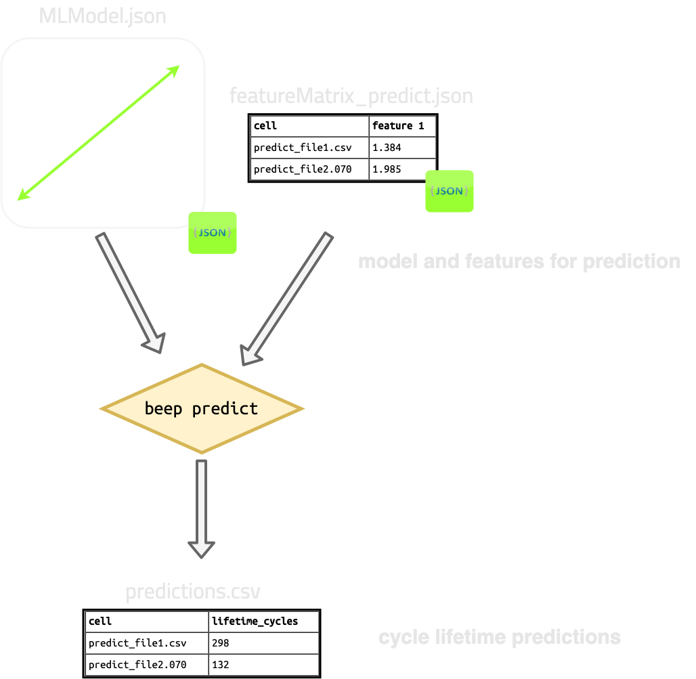

# Predict

`beep predict` runs previously trained models to predict degradation
characteristics based on a new input feature matrix.

`beep predict` takes in a previously trained model json file (e.g., trained
with [`beep train`](/Command%20Line%20Interface/4%20-%20train/) and a previously
generated feature matrix (e.g., generated
with [`beep featurize`](/Command%20Line%20Interface/3%20-%20featurize/)) which
you want ML predictions for. Each row in this input dataframe corresponds to a
single cycler file.

The output is a dataframe of predictions of degradation characteristics for each
file, serialized to disk as json. For example:

```shell

target_matrix
                         predicted capacity_0.92::TrajectoryFastCharge
filename                           
file1_to_predict                         287  
file2_to_predict                          59 
file3_to_predict                          82 
file4_to_predict                         103

```



## Predict help dialog

```shell
$: beep predict --help

Usage: beep predict [OPTIONS] MODEL_FILE

  Run a previously trained model to predict degradation targets.The MODEL_FILE
  passed should be an output of 'beep train' or aserialized
  BEEPLinearModelExperiment object.

Options:
  -fm, --feature-matrix-file TEXT
                                  Feature matrix to use as input to the model.
                                  Predictions are basedon these features.
                                  [required]
  -o, --output-filename FILE      Filename (json) to write the final predicted
                                  dataframe to.
  --predict-sample-nan-thresh FLOAT
                                  Threshold to keep a sample from any
                                  prediction set.
  --help                          Show this message and exit.

```


## Specifying inputs


`beep predict` requires two files as input:

1. A previously trained model file, which can be generated with [`beep train`](/Command%20Line%20Interface/4%20-%20train/) or in python via `BEEPLinearModelExperiment`.
2. A feature matrix file of features for *new* files for which you want degradation predictions
   1. The feature matrix file **must** have at least the features required by the trained model. Extra features will be automatically dropped.


The single model file is specified with the required argument `MODEL_FILE` (no globs) and the feature matrix is specified with `--feature-matrix-file`/`-fm`.


For example:

```shell
$: beep predict -fm /path/to/my/featurematix.json.gz /path/to/my/previously_trained_model.json.gz
```

## Specifying output

The output is a single serialized dataframe, which is by default auto-named but can be overridden by `--output-filename`/`-o`.


```shell
$: beep predict -fm /path/to/my/featurematix.json.gz \
  -o my_output_predictions.json
  /path/to/my/previously_trained_model.json.gz
```


