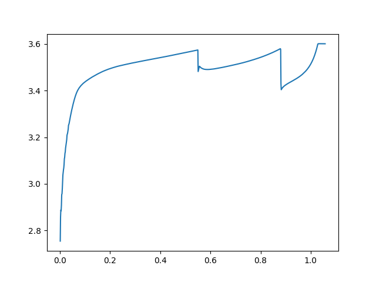
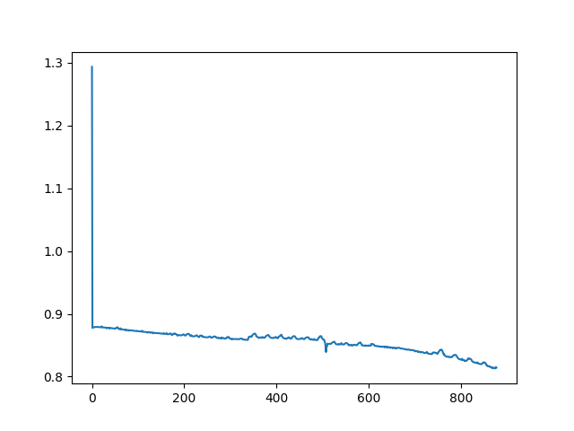

# 1: Quickstart

This notebook is meant to demonstrate basic usage of the beep package with data from "Data-driven prediction of battery cycle life before capacity degradation" KA Severson, et al. Nature Energy 4 (5), 383-391

This data is available for download from https://data.matr.io/1/ . For brevity, only one test is included in this notebook but the example can easily be extended to a larger number of files.


## Step 0: Install beep and set environment

If you have not already installed beep, run:


```bash
pip install beep
```


## Step 1: Download example battery cycler data

The example data set we are using here comes from a set of A123 LFP cells cycled under fast charge conditions. While this tutorial is configured for downloading a single cell, its also possible to download the entire data set and run all of the processing steps on all of the data.
 
 Note that for Arbin files, we recommend having the metadata file in addition to the data file in order to perform the data structuring correctly (though it is not required).
 
 


```python
import os
import requests

print('Beginning file download with requests')
this_dir = os.path.dirname(os.path.abspath(__file__))
data_dir = os.path.join(this_dir, 'Severson-et-al')

try:
    os.makedirs(data_dir)
except FileExistsError:
    pass

url = 'https://data.matr.io/1/api/v1/file/5c86c0bafa2ede00015ddf70/download'
r = requests.get(url)

with open(os.path.join(data_dir, '2017-05-12_6C-50per_3_6C_CH36.csv'), 'wb') as f:
    f.write(r.content)

url = 'https://data.matr.io/1/api/v1/file/5c86c0b5fa2ede00015ddf6d/download'
r = requests.get(url)

with open(os.path.join(data_dir, '2017-05-12_6C-50per_3_6C_CH36_Metadata.csv'), 'wb') as f:
    f.write(r.content)

# Retrieve HTTP meta-data
print("Status code", r.status_code)
print("File type recieved", r.headers['content-type'])
print("File encoding", r.encoding)
```


```
# output
Beginning file download with requests
Status code 200
File type recieved text/csv
File encoding ISO-8859-1
```

You should now have two files in your data directory: 

```
├── Severson-et-al
│   ├── 2017-05-12_6C-50per_3_6C_CH36.csv
│   └── 2017-05-12_6C-50per_3_6C_CH36_Metadata.csv
```

## Step 2: Structure and analyze data

Now that we have our data, we can start using BEEP!


To structure a file in `beep` using python, we use the `auto_load` function to get a `BEEPDatapath` object; `BEEPDatapath` holds everything
we need to identify cycler type, load, validate, interpolate, standardize, and analyze our file. 


```python
import os
from beep.structure.cli import auto_load


this_dir = os.path.dirname(os.path.abspath(__file__))
cycler_file = os.path.join(this_dir, "Severson-et-al/2017-05-12_6C-50per_3_6C_CH36.csv")

datapath = auto_load(cycler_file)
```


We can check our file is valid with `validate`:

```python
is_valid, msg = datapath.validate()
print("File is valid: ", is_valid)
```

```shell
# Output
File is valid: True
```


We can easily interpolate and prepare our file for analysis (known as "structuring") with the `structure` method:


```python
datapath.structure()
```

Now that our file has been structured, we can examine some interesting properties, such as the charge capacity vs. the voltage.


```python
from matplotlib import pyplot as plt

reg_charge = datapath.structured_data[datapath.structured_data.step_type == 'charge']
print("Mean current for cycle 25: ", reg_charge.current[reg_charge.cycle_index == 25].mean())
print("Number of cycles: ", reg_charge.cycle_index.max())
print("Max charge capacity at cycle 25: ", reg_charge.charge_capacity[reg_charge.cycle_index == 25].max())
plt.plot(reg_charge.charge_capacity[reg_charge.cycle_index == 600], reg_charge.voltage[reg_charge.cycle_index == 600])
plt.show()
```

```
# output
Mean current for cycle 25: 4.697416
Number of cycles: 876
Max charge capacity at cycle 25: 1.1737735
```





We can also view some interesting data about the energy efficiency as the cycles progress:

```python
plt.plot(datapath.structured_summary.cycle_index, datapath.structured_summary.energy_efficiency)
plt.show()
```




[More info on `BEEPDatapath`](/Python%20tutorials/2%20-%20structuring/)


## Step 3: Prepare for machine learning and train a model

Featurization uses the structured objects to calculate statistically and physically relevant quantities for the purpose of building predictive machine learning models. The objects can be selected and joined for the purposes of training the model, or used for predicting individual outcomes.

`beep` provides classes such as `BEEPFeaturizer` and `BEEPFeatureMatrix` for generating and managing sets of features linked to structured files.

`beep` also provides `BEEPLinearModelExperiment`, a class for training linear machine learning models on battery data and predicting new degradation characteristics.


**Quickstart sections on featurization and machine learning are coming soon!**


## Congrats!

You've made it to the end of the tutorial. 
