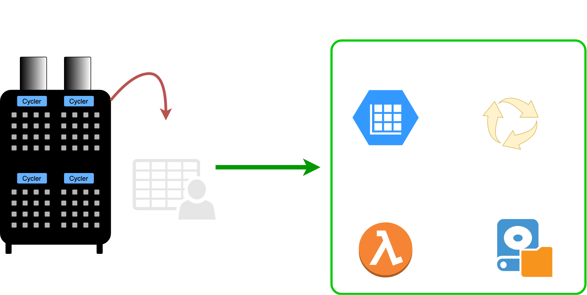

# 2: Structuring

Here you'll find more info about creating and using beep to do your own custom cycler analyses.


- [`BEEPDatapath` - One object for ingestion, structuring, and validation](#structuring-with-beepdatapath)
- [Batch functions for structuring](#batch-functions-for-structuring)
- [Featurization](#featurization)
- [Running and analyzing models](#running-and-analyzing-models)


## Structuring with `BEEPDatapath` 
### One class for ingestion, structuring, and validation




`BEEPDatapath` is an abstract base class that can handle ingestion, structuring, and validation for many types of cyclers. A datapath
object represents a complete processing pipeline for battery cycler data.

Each cycler has it's own `BEEPDatapath` class:

- `ArbinDatapath`
- `MaccorDatapath`
- `NewareDatapath`
- `IndigoDatapath`
- `BiologicDatapath`

**All these datapaths implement the same core methods, properties, and attributes, listed below:**

### Methods for loading and serializing battery cycler data

#### `*Datapath.from_file(filename)`
Classmethod to load a raw cycler output file (e.g., a csv) into a datapath object. Once loaded, you can validate or structure the file.
  
```python
# Here we use ArbinDatapath as an example
from beep.structure import ArbinDatapath

datapath = ArbinDatapath.from_file("my_arbin_file.csv")

```

#### `*Datapath.to_json_file(filename)`
Dump the current state of a datapath to a file. Can be later loaded with `from_json_file`.
  
```python
from beep.structure import NewareDatapath

datapath = NewareDatapath.from_file("/path/to/my_raw_neware_file")

# do some operations
...

# Write the processed file to disk, which can then be loaded.
datapath.to_json_file("my_processed_neware_data.json")
```


#### `*Datapath.from_json_file(filename)`
Classmethod to load a processed cycler file (e.g., a previously structured Datapath) into a datapath object.  
  
```python
from beep.structure import MaccorDatapath

datapath = MaccorDatapath.from_json_file("my_previously_serialized_datapath.json")
```


#### `*Datapath(data, metadata, paths=None, **kwargs)`
Initialize any cycler from the raw data (given as a pandas dataframe) and metadata (given as a dictionary). Paths can be included to keep track of where various cycler files are located. **Note: This is not the recommended way to create a `BEEPDatapath`, as `data` and `metadata` must have specific formats to load and structure correctly.**


### Validation and structuring with `BEEPDatapath`s

#### `*Datapath.validate()`
Validate your raw data. Will return true if the raw data is valid for your cycler (i.e., can be structured successfully).

```python
from beep.structure import IndigoDatapath


datapath = IndigoDatapath.from_file("/path/to/my_indigo_file")

is_valid = datapath.validate()

print(is_valid)

# Out:
# True or False
```

#### `*Datapath.structure(*args)`
Interpolate and structure your data using specified arguments. Once structured, your `BEEPDatapath` is able to access things like the diagnostic summary, interpolated cycles, cycle summary, diagnostic summary, cycle life, and more (see [Analysis and attributes of core attributes of `BEEPDatapath`](#analysis-and-core-attributes-of-beepdatapath))

```python

from beep.structure import ArbinDatapath

datapath = ArbinDatapath.from_file("my_arbin_file.csv")

# Structure your data by manually specifying parameters.
datapath.structure(v_range=[1.2, 3.5], nominal_capacity=1.2, full_fast_charge=0.85)

```

#### `*Datapath.autostructure()`
Run structuring using automatically determined parameters. BEEP can automatically detect the structuring parameters based on your raw data.

**Note: The BEEP environment variable `BEEP_PROCESSING_DIR` must be set before autostructuring, and this directory must contain a parameters file which can be used for `determine_structuring_parameters`.**


```python
from beep.structure import BiologicDatapath


datapath = BiologicDatapath.from_file("path/to/my/biologic_data_file")

# Automatically determines structuring parameters and structures data
datapath.autostructure()
```


### Analysis and core attributes of `BEEPDatapath`


#### `*Datapath.paths`

Access all paths of files related to this datapath. `paths` is a simple mapping of `{file_description: file_path}` which holds the paths of **all** files related to this datapath, including raw data, metadata, EIS files, and structured outputs.


```python
from beep.structure import ArbinDatapath

datapath = ArbinDatapath.from_file("/path/to/my_arbin_file.csv")
print(datapath.paths)

# Out:
{"raw": "/path/to/my_arbin_file.csv", "metadata": "/path/to/my_arbin_file_Metadata.csv"}
```


#### `*Datapath.structuring_parameters`

Parameters used to structure `BEEPDatapaths`:


```python
from beep.structure import ArbinDatapath

datapath = ArbinDatapath.from_file("/path/to/my_arbin_file.csv")
datapath.autostructure()

print(datapath.structuring_parameters)

# Out:
{'v_range': None,
 'resolution': 1000,
 'diagnostic_resolution': 500,
 'nominal_capacity': 1.1,
 'full_fast_charge': 0.8,
 'diagnostic_available': False,
 'charge_axis': 'charge_capacity',
 'discharge_axis': 'voltage'}

```


#### `*Datapath.raw_data`

The raw data, loaded into a standardized dataframe format, of this datapath's battery cycler data.


```python
from beep.structure import ArbinDatapath

datapath = ArbinDatapath.from_file("/path/to/my_arbin_file.csv")
print(datapath.raw_data)


# Out:
        data_point   test_time  ...  temperature              date_time_iso
0                0      0.0021  ...    20.750711  2017-12-05T03:37:36+00:00
1                1      1.0014  ...    20.750711  2017-12-05T03:37:36+00:00
2                2      1.1165  ...    20.750711  2017-12-05T03:37:36+00:00
3                3      2.1174  ...    20.750711  2017-12-05T03:37:36+00:00
4                4     12.1782  ...    20.750711  2017-12-05T03:37:36+00:00
...            ...         ...  ...          ...                        ...
251258      251258  30545.2000  ...    32.595604  2017-12-14T00:10:40+00:00
251259      251259  30545.2000  ...    32.555054  2017-12-14T00:10:40+00:00
251260      251260  30550.1970  ...    32.555054  2017-12-14T00:12:48+00:00
251261      251261  30550.1970  ...    32.545870  2017-12-14T00:12:48+00:00
251262      251262  30555.1970  ...    32.445827  2017-12-14T00:12:48+00:00
```


#### `*Datapath.metadata`

An object holding all metadata for this datapath's cycler run.


```python
from beep.structure import ArbinDatapath

datapath = ArbinDatapath.from_file("/path/to/my_arbin_file.csv")
print(datapath.metadata.barcode)
print(datapath.metadata.channel_id)
print(datapath.metadata.protocol)
print(datapath.metadata.raw)


# Out:
"EL151000429559"
28
'2017-12-04_tests\\20170630-4_65C_69per_6C.sdu'
{'test_id': 296, 'device_id': 60369369, 'channel_id': 28, 'start_datetime': 1512445026, '_resumed_times': 0, 'last_resume_datetime': 0, '_last_end_datetime': 1512514129, 'protocol': '2017-12-04_tests\\20170630-4_65C_69per_6C.sdu', '_databases': 'ArbinResult_43,ArbinResult_44,ArbinResult_45,', 'barcode': 'EL151000429559', '_grade_id': 0, '_has_aux': 3, '_has_special': 0, '_schedule_version': 'Schedule Version 7.00.08', '_log_aux_data_flag': 1, '_log_special_data_flag': 0, '_rowstate': 0, '_canconfig_filename': nan, '_m_ncanconfigmd5': nan, '_value': 0.0, '_value2': 0.0}
```


#### `*Datapath.structured_data`

The structured (interpolated) data, as a dataframe. The format is similar to that of `.raw_data`. The datapath must be structured before this attribute is available.

```python
from beep.structure import ArbinDatapath

datapath = ArbinDatapath.from_file("/path/to/my_arbin_file.csv")
datapath.autostructure()
print(datapath.structured_data)


# Out:
         voltage  test_time  current  ...  temperature  cycle_index  step_type
0       2.500000        NaN      NaN  ...          NaN            0  discharge
1       2.501702        NaN      NaN  ...          NaN            0  discharge
2       2.503403        NaN      NaN  ...          NaN            0  discharge
3       2.505105        NaN      NaN  ...          NaN            0  discharge
4       2.506807        NaN      NaN  ...          NaN            0  discharge
          ...        ...      ...  ...          ...          ...        ...
461995       NaN        NaN      NaN  ...          NaN          245     charge
461996       NaN        NaN      NaN  ...          NaN          245     charge
461997       NaN        NaN      NaN  ...          NaN          245     charge
461998       NaN        NaN      NaN  ...          NaN          245     charge
461999       NaN        NaN      NaN  ...          NaN          245     charge
```

#### `*Datapath.structured_summary`

A summary of the structured cycler data, as a dataframe. The datapath must be structured before this attribute is available.

```python
from beep.structure import MaccorDatapath

datapath = MaccorDatapath.from_file("/path/to/my_maccor_file.071")
datapath.autostructure()
print(datapath.structured_summary)


# Out:
             cycle_index  discharge_capacity  charge_capacity  discharge_energy  charge_energy  dc_internal_resistance  temperature_maximum  temperature_average  temperature_minimum              date_time_iso  energy_efficiency  charge_throughput  energy_throughput  charge_duration  time_temperature_integrated  paused
cycle_index                                                                                                                                                                                                                                                                                                                    
0                      0            4.719281         3.827053         17.273731      14.901985                     0.0                  NaN                  NaN                  NaN  2019-12-17T17:51:51+00:00           1.159156           3.827053          14.901985              NaN                          NaN    4957
6                      6            2.074518         4.406801          7.677041      16.997186                     0.0                  NaN                  NaN                  NaN  2019-12-20T13:14:40+00:00           0.451665           8.233854          31.899172           5791.0                          NaN       0
7                      7            2.097911         2.108322          7.775166       8.597635                     0.0                  NaN                  NaN                  NaN  2019-12-20T15:51:34+00:00           0.904338          10.342176          40.496807              NaN                          NaN       0
8                      8            2.074545         2.098428          7.684986       8.557546                     0.0                  NaN                  NaN                  NaN  2019-12-20T17:32:21+00:00           0.898036          12.440605          49.054352              NaN                          NaN       0
9                      9            2.074061         2.082069          7.685348       8.494265                     0.0                  NaN                  NaN                  NaN  2019-12-20T19:12:46+00:00           0.904769          14.522674          57.548618              NaN                          NaN       0
10                    10            2.065671         2.069061          7.655246       8.441246                     0.0                  NaN                  NaN                  NaN  2019-12-20T20:52:53+00:00           0.906886          16.591734          65.989861              NaN                          NaN       0
11                    11            2.064542         2.068921          7.651949       8.439011                     0.0                  NaN                  NaN                  NaN  2019-12-20T22:32:38+00:00           0.906735          18.660656          74.428871              NaN                          NaN       0
12                    12            2.068333         2.061454          7.666199       8.409441                     0.0                  NaN                  NaN                  NaN  2019-12-21T00:12:35+00:00           0.911618          20.722109          82.838318              NaN                          NaN       0
13                    13            2.054566         2.067370          7.616584       8.431127                     0.0                  NaN                  NaN                  NaN  2019-12-21T01:52:14+00:00           0.903389          22.789478          91.269440              NaN                          NaN       0
14                    14            2.061369         2.057715          7.647454       8.394535                     0.0                  NaN                  NaN                  NaN  2019-12-21T03:31:54+00:00           0.911004          24.847195          99.663979              NaN                          NaN       0
15                    15            2.050721         2.059819          7.602874       8.401562                     0.0                  NaN                  NaN                  NaN  2019-12-21T05:11:24+00:00           0.904936          26.907013         108.065536              NaN                          NaN       0
16                    16            2.055427         2.057405          7.622452       8.393292                     0.0                  NaN                  NaN                  NaN  2019-12-21T06:50:57+00:00           0.908160          28.964418         116.458832              NaN                          NaN       0
17                    17            2.045344         2.049606          7.583858       8.360918                     0.0                  NaN                  NaN                  NaN  2019-12-21T08:30:36+00:00           0.907060          31.014025         124.819748              NaN                          NaN       0
18                    18            2.047280         2.046608          7.591624       8.347446                     0.0                  NaN                  NaN                  NaN  2019-12-21T10:09:56+00:00           0.909455          33.060631         133.167191              NaN                          NaN       0
19                    19            2.055454         2.046478          7.623849       8.347916                     0.0                  NaN                  NaN                  NaN  2019-12-21T11:49:18+00:00           0.913264          35.107109         141.515106              NaN                          NaN       0
20                    20            2.043676         2.055780          7.579766       8.383341                     0.0                  NaN                  NaN                  NaN  2019-12-21T13:28:39+00:00           0.904146          37.162891         149.898453              NaN                          NaN       0
21                    21            2.049323         2.046085          7.605977       8.346517                     0.0                  NaN                  NaN                  NaN  2019-12-21T15:08:10+00:00           0.911276          39.208977         158.244965              NaN                          NaN       0
22                    22            2.038514         2.047097          7.560916       8.349430                     0.0                  NaN                  NaN                  NaN  2019-12-21T16:47:22+00:00           0.905561          41.256073         166.594406              NaN                          NaN       0
23                    23            2.044779         2.045038          7.585164       8.342201                     0.0                  NaN                  NaN                  NaN  2019-12-21T18:26:38+00:00           0.909252          43.301109         174.936600              NaN                          NaN       0
24                    24            2.039805         2.039563          7.567169       8.319416                     0.0                  NaN                  NaN                  NaN  2019-12-21T20:06:10+00:00           0.909579          45.340672         183.256012              NaN                          NaN       0
25                    25            2.039563         2.040318          7.566332       8.320876                     0.0                  NaN                  NaN                  NaN  2019-12-21T21:45:20+00:00           0.909319          47.380993         191.576889              NaN                          NaN       0
26                    26            2.052362         2.038989          7.616830       8.316606                     0.0                  NaN                  NaN                  NaN  2019-12-21T23:24:33+00:00           0.915858          49.419979         199.893494              NaN                          NaN       0
27                    27            2.035744         2.051446          7.552814       8.364671                     0.0                  NaN                  NaN                  NaN  2019-12-22T01:03:48+00:00           0.902942          51.471428         208.258163              NaN                          NaN       0
28                    28            2.039347         2.041048          7.568011       8.325755                     0.0                  NaN                  NaN                  NaN  2019-12-22T02:43:14+00:00           0.908988          53.512474         216.583923              NaN                          NaN       0

```

#### `*Datapath.diagnostic_data`

The structured (interpolated) data for diagnostic cycles, as a dataframe. The format is similar to that of `.structured_data`. The datapath must be structured before this attribute is available.

```python
from beep.structure import MaccorDatapath

datapath = MaccorDatapath.from_file("/path/to/my_maccor_file_with_diagnostic.071")
datapath.autostructure()
print(datapath.diagnostic_data)


# Out:
        voltage    test_time   current  ...  step_type  discharge_dQdV  charge_dQdV
0      2.700000          NaN       NaN  ...          0             NaN          NaN
1      2.703006          NaN       NaN  ...          0             NaN          NaN
2      2.706012          NaN       NaN  ...          0             NaN          NaN
3      2.709018          NaN       NaN  ...          0             NaN          NaN
4      2.712024          NaN       NaN  ...          0             NaN          NaN
         ...          ...       ...  ...        ...             ...          ...
44434  2.782701  1958305.375  1.612107  ...          0             0.0     0.006379
44435  2.783219  1958305.375  1.612090  ...          0             0.0     0.006379
44436  2.783736  1958305.375  1.612073  ...          0             0.0     0.006379
44437  2.784254  1958305.375  1.612056  ...          0             0.0     0.006379
44438  2.784771  1958305.375  1.612039  ...          0             0.0     0.006379
[44439 rows x 16 columns]
```

#### `*Datapath.diagnostic_summary`

A summary of the structured diagnostic cycle data, as a dataframe. The datapath must be structured before this attribute is available.

```python
from beep.structure import MaccorDatapath

datapath = MaccorDatapath.from_file("/path/to/my_maccor_file_with_diagnostic.071")
datapath.autostructure()
print(datapath.diagnostic_summary)


# Out:
    cycle_index  discharge_capacity  ...  paused  cycle_type
0             1            4.711819  ...       0       reset
1             2            4.807243  ...       0        hppc
2             3            4.648884  ...       0    rpt_0.2C
3             4            4.525516  ...       0      rpt_1C
4             5            4.482939  ...       0      rpt_2C
5            36            4.624467  ...       0       reset
6            37            4.722887  ...       0        hppc
7            38            4.584861  ...       0    rpt_0.2C
8            39            4.476485  ...       0      rpt_1C
9            40            4.426849  ...       0      rpt_2C
10          141            4.529535  ...       0       reset
11          142            4.621750  ...       0        hppc
12          143            4.486644  ...       0    rpt_0.2C
13          144            4.391235  ...       0      rpt_1C
14          145            4.336987  ...       0      rpt_2C
15          246            4.459362  ...       0       reset
16          247            4.459362  ...       0        hppc
```

#### `*Datapath.get_cycle_life(n_cycles, threshold)`

Calculate the cycle life for capacity loss below a certain threshold.

```python
from beep.structure import MaccorDatapath

datapath = MaccorDatapath.from_file("/path/to/my_maccor_file.071")
datapath.autostructure()
print(datapath.get_cycle_life())


# Out:
231
```


#### `*Datapath.cycles_to_capacities(cycle_min, cycle_max, cycle_interval)`

Get the capacities for an array of cycles in an interval.

```python
from beep.structure import MaccorDatapath

datapath = MaccorDatapath.from_file("/path/to/my_maccor_file.071")
datapath.autostructure()
print(datapath.cycles_to_capacities(cycle_min=50, cycle_max=200, cycle_interval=50))


# Out:
   cycle_50  cycle_100  cycle_150
0  2.020498   1.981053   1.965753
```


#### `*Datapath.capacities_to_cycles(thresh_max_cap, thresh_min_cap, interval_cap)`

Get the number of cycles to reach an array of threshold capacities in an interval.

```python
from beep.structure import MaccorDatapath

datapath = MaccorDatapath.from_file("/path/to/my_maccor_file.071")
datapath.autostructure()
print(datapath.capacities_to_cycles())


# Out:
   capacity_0.98  capacity_0.95  capacity_0.92  capacity_0.89  capacity_0.86  capacity_0.83  capacity_0.8
0             76            185            231            231            231            231           231
```

#### `*Datapath.is_structured`

Tells whether the datapath has been structured or not.

```python
from beep.structure import MaccorDatapath

datapath = MaccorDatapath.from_file("/path/to/my_maccor_file.071")

print(datapath.is_structured)

# Out:
False

datapath.structure()
print(datapath.is_structured)

# Out:
True
```


---


### Making your own `BEEPDatapath`

If your cycler is not already supported by BEEP, you can write a class for structuring its data with BEEP by inheriting `BEEPDatapath` and implementing one method: `from_file`.


```python
from beep.structure import BEEPDatapath


class MyCustomCyclerDatapath(BEEPDatapath):
    """An example of implementing a custom BEEPDatapath for your own cycler.
    """

    @classmethod
    def from_file(cls, filename):
        # Load your file from the raw file filename
        
        data = pd.read_csv(filename)
        # Parse the raw data
        # The raw data must adhere to BEEP standards. See the beep/conversion_schemas for the list of canonical data columns the raw data dataframe must posess.
        
        # Your own code for converting the raw data to contain BEEP columns
        data = convert_my_custom_cycler_data_to_BEEP_dataframe(data)
        
        # Parse the metadata using your own code
        # Metadata must return a dictionary
        # Should preferably contain "barcode", "protocol", and "channel_id" keys at a minimum.
        metadata_filename = filename + "_metadata"
        metadata = my_metadata_parsing_function(metadata_filename)

        # Store the paths in a dictionary
        paths = {
            "raw": filename,
            "metadata": filename + "_Metadata"
        }

        return cls(data, metadata, paths)
```

Your custom datapath class can create new methods or override existing `BEEPDatapath` methods if needed.

Once you have written your custom class's `from_file` method, all the existing behavior of `BEEPDatapath` should be available, including 

- `structure()`
- `validate()`
- `autostructure()`
- `paths`
- `raw_data`
- `structured_summary`
- `structured_data`
- `diagnostic_data`
- etc.


### Electrochemical Impedance Spectra

More documentation for EIS coming soon!


## Structuring compatibility with processed legacy BEEP files

Both legacy and `*Datapath` processed (structured) files saved as json should load with `*Datapath.from_json_file`, but the capabilities between files serialized with legacy and files serialized with newer `BEEPDatapath` files will differ. 
**The main discrepancy is that legacy files cannot be restructured once loaded.** All of `BEEPDatapath`'s other structured attributes and properties should function for legacy files identically to those serialized with newer `BEEPDatapath`.

See [the `auto_load_processed` documentation](#auto_load_processed) for more info on loading legacy processed `BEEPDatapath`s. 


## Top-level functions for structuring

Aside from the CLI (shown in [the command line interface guide](/Command%20Line%20Interface/2%20-%20structuring/), BEEP also contains lower-level python functions for helping loading and structuring many cycler output files from different cyclers.

#### `auto_load`

Auto load will look at the file signature of a raw cycler run output file and automatically load the correct datapath (provided the cycler is supported by BEEP).


```python
from beep.structure import auto_load


arbin_datapath = auto_load("/path/to/my_arbin_file.csv")
print(arbin_datapath)

# Out:
<ArbinDatapath object>

maccor_datapath = auto_load("/path/to/my_maccor_file")
print(maccor_datapath)

# Out:
<MaccorDatapath object>

```


#### `auto_load_processed`

Automatically loads the correct datapath for any previously serialized processed (structured) BEEP file.

While processed run .json files serialized with `*Datapath` classes can be loaded with `monty.serialization.loadfn`, processed files serialized with older BEEP versions may not work with `loadfn`.
`auto_load_processed` will automatically load the correct datapath, even for legacy BEEP processed .json files, though the functionality of these datapaths is restricted. For example, legacy datapaths
cannot be restructured.

```python
from beep.structure import auto_load_processed

arbin_datapath_processed = auto_load_processed("/path/to/my_processed_arbin_file.json")
print(arbin_datapath_processed)

# Out:
<ArbinDatapath object>

processed_datapath_legacy = auto_load_processed("/path/to/my_legacy_neware_file")
print(processed_datapath_legacy)

# Out:
<NewareDatapath object>
```